> [!NOTE]
> + Developer's Section: The first section is to be completed solely by the developer who has made the changes
> + Reviewer's Section: The second section is reserved for the reviewer, who must be a senior or lead developer within the team
> + Below is the process to be followed for PR approval !

```mermaid
graph LR;
    step1["`Developer 🔽
    Complete the details under the Developer section`"]
    step2["`Reviewer 🔽
    Read the provided details`"]
    step3["`Reviewer 🔽
    After reviewing components, provide comments`"]
    step4["`Developer 🔽
    Address any reviewer comments`"]
    step5["`Reviewer 🔽
    Provide feedback under the Reviewer section
    and approve the PR if satisfied`"]
    step1-->step2-->step3-->step4-->step5
```

          

<b>**** 👨‍💻 Developer Section 👩‍💻 ****</b>

&nbsp;&nbsp;&nbsp;&nbsp;&nbsp;&nbsp;&nbsp;&nbsp;&nbsp;&nbsp;

### 📝 Why this PR is created?
[**DEVELOPER INPUT REQUIRED:** Write one line about the changes here]

&nbsp;&nbsp;&nbsp;&nbsp;&nbsp;&nbsp;&nbsp;&nbsp;&nbsp;&nbsp;

### 📜 What type of changes this Pull Request Consists of? (Check one or many)

- [ ] 🚀 New feature
- [ ] 🐞 Bug fix
- [ ] 📚 Documentation update
- [ ] 🔧 Refactoring
- [ ] 🔥 Hotfix
- [ ] 🔐 Security patch
- [ ] 🖼️ UI/UX improvement
- [ ] ✅ Tests
- [ ] 🛠️ Other

&nbsp;&nbsp;&nbsp;&nbsp;&nbsp;&nbsp;&nbsp;&nbsp;&nbsp;&nbsp;

### 💬 Have you perform below steps? (Check one or many) 

- [ ] My code adheres to the coding and style guidelines of the project
- [ ] I have performed a self-review of my own code
- [ ] I have commented my code, particularly in hard-to-understand areas
- [ ] I have made corresponding changes to the documentation
- [ ] My changes generate no new warnings 

&nbsp;&nbsp;&nbsp;&nbsp;&nbsp;&nbsp;&nbsp;&nbsp;&nbsp;&nbsp;

### 🔄 Deployment Steps (Check one or many) 

- [ ] Any pre step is required for this story ?
- [ ] Any post step is required for this story ?

&nbsp;&nbsp;&nbsp;&nbsp;&nbsp;&nbsp;&nbsp;&nbsp;&nbsp;&nbsp;

### 📋 Tell the critical code to be reviewed by reviewers 
[**DEVELOPER INPUT REQUIRED:** Write any note for reviewer here]

&nbsp;&nbsp;&nbsp;&nbsp;&nbsp;&nbsp;&nbsp;&nbsp;&nbsp;&nbsp;

<b>**** 👨‍💻 Reviewer Section 👩‍💻 ****</b>

&nbsp;&nbsp;&nbsp;&nbsp;&nbsp;&nbsp;&nbsp;&nbsp;&nbsp;&nbsp;

## 👥 Reviewer Instructions

1. Review Details: Read through the provided details in the Developer Section
2. Check Components: Verify that the code changes are correctly implemented and align with the project requirements. Ensure that all coding standards are adhered to, as detailed in the provided references in the tip section
3. Fill Inputs In Reviewer Section: Provide comments in the reviewer section before completing the Pull Request

&nbsp;&nbsp;&nbsp;&nbsp;&nbsp;&nbsp;&nbsp;&nbsp;&nbsp;&nbsp;

### 🕵️‍♂️ Tell the critical code to be reviewed by reviewers 
[**REVIEWER INPUT REQUIRED:** Write any note before marking this pull request completed]

&nbsp;&nbsp;&nbsp;&nbsp;&nbsp;&nbsp;&nbsp;&nbsp;&nbsp;&nbsp;

> [!TIP]
> + Click Here For : [Code Review CheckList](https://confluence-eng-rtp1.cisco.com/conf/display/SFDC/Code+Review+Checklist)
> + Click Here For : [Flow Review CheckList](https://confluence-eng-rtp1.cisco.com/conf/display/SFDC/Flow+Review+Checklist)
> + Click Here For : [Get Github Copilot Access](https://wiki.cisco.com/pages/viewpage.action?pageId=1728769116)
> + Click Here For : [Create Ticket With Platform Team](https://lifecyclespirit.cisco.com/)
> + Click Here For : [SonarQube Rules](https://cloudcodeanalysis.com/coding_rules?languages=apex)

&nbsp;&nbsp;&nbsp;&nbsp;&nbsp;&nbsp;&nbsp;&nbsp;&nbsp;&nbsp;

🌟 👏 👍 🙏 🙌 Thank you for contributing! 🙌 🙏 👍 👏 🌟
